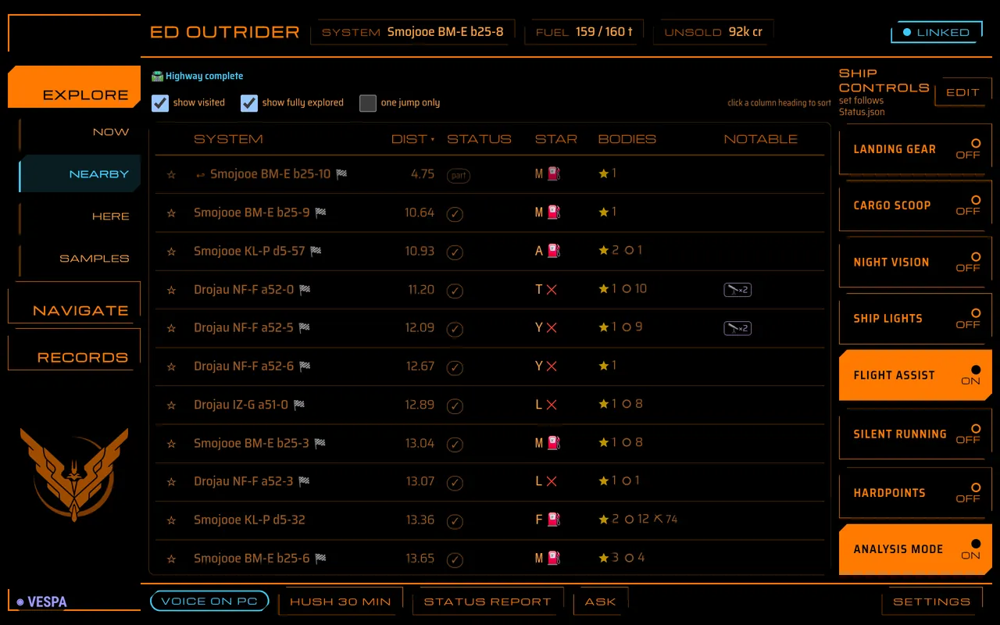
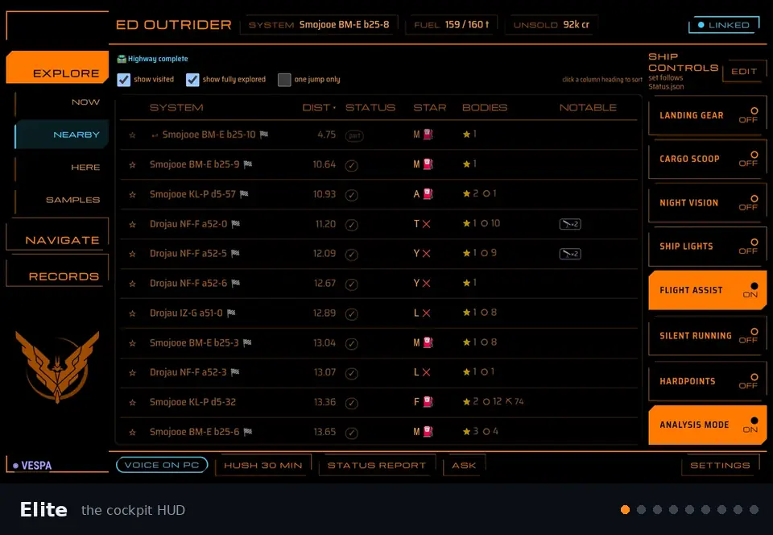
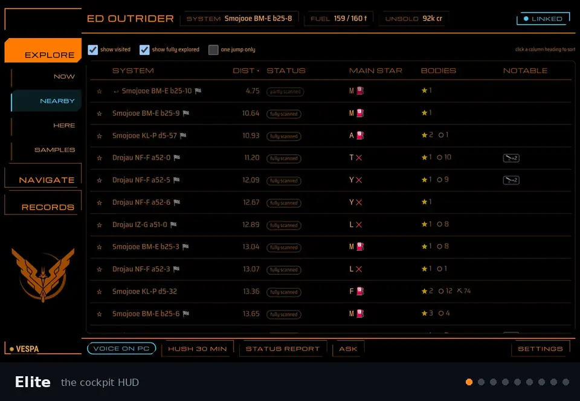

<p align="center">
  
</p>

<h1 align="center">ED Outrider for Android</h1>

<p align="center">
  <b>Your exploration assistant on a second screen: a cockpit tablet for <a href="https://github.com/weslocke/ED-Outrider">ED Outrider</a>.</b>
</p>

<p align="center">
  <a href="https://github.com/weslocke/ED-Outrider"></a>
  
  
  
</p>

---

## What this is

**[ED Outrider](https://github.com/weslocke/ED-Outrider)** is an Elite Dangerous exploration assistant that runs on
your own machines: on the gaming PC, or on another computer on your network. It reads your game journals as you play and keeps a live page up to date with what an explorer keeps
alt-tabbing for: who has been to the systems around you, what's in the one you're in, what your unsold data is worth,
your bio samples and first discoveries, routes to plot and follow (the Neutron Highway, Exomastery, trade routes),
the nearest place to dock, your cargo and fleet carrier, and spoken alerts.

**This app is a client for it.** It puts Outrider's tablet layout on an Android tablet beside your HOTAS, so the game
keeps the whole monitor. Outrider still does all the work, wherever it runs; the app is the cockpit display, and it adds what
a browser tab can't: a full-screen landscape window that keeps the screen on, signs in by itself, reconnects after
the tablet sleeps, and listens for your voice.

> You need ED Outrider running on a computer on your network: this app does nothing on its own. Get it at
> **[github.com/weslocke/ED-Outrider](https://github.com/weslocke/ED-Outrider)**.

<p align="center">
  
</p>

## Features

| | |
|---|---|
| 🖥️ **Cockpit display** | Outrider's tablet layout full screen, landscape, screen kept on: Now, Nearby, Here, Samples, Bookmarks, Search, Map, Plot Route (with the [nearest place to dock](https://github.com/weslocke/ED-Outrider/blob/main/docs/guide/plot-route.md#-nearest-place-to-dock)), History, Log, Materials (your cargo and carrier) and My firsts. See Outrider's [tablet guide](https://github.com/weslocke/ED-Outrider/blob/main/docs/guide/tablet.md). |
| 🕹️ **Ship controls** | A column of game buttons (landing gear, cargo scoop, lights, silent running, ...) that press your own key bindings in the game, lit from the game's own status. Changes with the vehicle: ship, SRV, fighter, on foot. *(Needs Outrider on the gaming PC, on Linux; an Outrider in server mode shows no game buttons.)* |
| 🎙️ **"Hey Vespa"** | Say *"Hey / OK / Hello Vespa"*, then ask: *status report*, *fuel*, *unsold*, *next jump*, *what's left here*, *nearest unvisited*, *nearest station* (or *nearest carrier*, *nearest Vista*, *where can I dock*), *hush*. Outrider answers out loud in its own voice (or the tablet reads it, when Outrider can't). The wake word is yours to change. |
| 🔊 **Alerts on the tablet** | With Outrider on a server and no browser open, the tablet itself speaks Outrider's alerts in Outrider's voice and plays its sounds; you pick which ones. |
| 🎨 **Themes** | Elite (cockpit HUD), Babylon 5 (Earthforce, Narn, Minbari and Centauri), LCARS, Star Wars (Sith and Alliance) and a modern Dark mode, with their factions' emblems; picked in the page's settings, and the app's own screens follow. |
| 🔒 **Signs in once** | When Outrider asks devices on the network for a password, the app signs in and stays signed in until it changes. |
| 🔁 **Reconnects** | Says plainly when Outrider can't be reached, and picks up again by itself when it's back. |
| ⬇️ **Exports** | Outrider's CSV and JSON exports save to the tablet's Downloads. |
| 🔀 **More than one Outrider** | Remembers the Outriders it has used (say one on the game PC and one on a server) and switches between them from Settings → Tablet app → Server…, each staying signed in. |

### Themes

Nine themes, picked in Outrider's tablet **Settings**; the app's own screens follow. Each one but LCARS and Dark shows
its faction's emblem under the page list (**Show the theme's emblem** turns it off).

**With the ship controls** (Outrider on the gaming PC):

<p align="center">
  
</p>

**Outrider on a server** (no game buttons, the page uses the whole width):

<p align="center">
  
</p>

<p align="center"><sub>Full size, with the ship controls:
<a href="docs/images/rail-elite.webp">Elite</a> ·
<a href="docs/images/rail-babylon5.webp">Earthforce</a> ·
<a href="docs/images/rail-narn.webp">Narn</a> ·
<a href="docs/images/rail-minbari.webp">Minbari</a> ·
<a href="docs/images/rail-centauri.webp">Centauri</a> ·
<a href="docs/images/rail-lcars.webp">LCARS</a> ·
<a href="docs/images/rail-sith.webp">Sith</a> ·
<a href="docs/images/rail-alliance.webp">Alliance</a> ·
<a href="docs/images/rail-dark.webp">Dark</a><br>
on a server:
<a href="docs/images/server-elite.webp">Elite</a> ·
<a href="docs/images/server-babylon5.webp">Earthforce</a> ·
<a href="docs/images/server-narn.webp">Narn</a> ·
<a href="docs/images/server-minbari.webp">Minbari</a> ·
<a href="docs/images/server-centauri.webp">Centauri</a> ·
<a href="docs/images/server-lcars.webp">LCARS</a> ·
<a href="docs/images/server-sith.webp">Sith</a> ·
<a href="docs/images/server-alliance.webp">Alliance</a> ·
<a href="docs/images/server-dark.webp">Dark</a></sub></p>

## Getting started

**You need**

- [ED Outrider](https://github.com/weslocke/ED-Outrider), a version with the tablet layout (2026.10.7 or newer for
  everything below), running on a computer on your network (the gaming PC, or another machine such as a home server,
  [in Docker](https://github.com/weslocke/ED-Outrider/blob/main/docs/guide/install.md#-running-as-a-server-docker)) and listening on the network:
  `[server] host = "0.0.0.0"` in `ed_outrider.toml` (not only `127.0.0.1`).
- An Android tablet with Android 8 or newer on the same network, with an ARM processor (nearly all phones and tablets;
  Intel/x86 devices such as emulators and some Chromebooks aren't supported). It's built for an 11" landscape screen
  (tested on a Galaxy Tab A11+).

### Installing (sideloading)

The app isn't in an app store: you install the APK file yourself ("sideloading"). It takes a couple of minutes, once.

**On the tablet**

1. On the tablet, open the [latest release](https://github.com/weslocke/ED-Outrider-Android/releases/latest) in its
   browser and tap **`ED-Outrider-<version>.apk`** under *Assets* to download it.
2. Open the download: from the browser's download notification, or in the **Files** / **My Files** app under
   **Downloads**.
3. Android asks to allow installing apps from that source (the browser or the Files app). Tap **Settings**, turn on
   **Allow from this source**, and go back. If it doesn't ask, the setting is under **Settings → Apps → Special access
   → Install unknown apps** (on Samsung: **Settings → Apps → ⋮ → Special access → Install unknown apps**); pick the
   browser or Files app and allow it.
4. Tap **Install**. Google Play Protect may warn about an app from an unknown developer: tap **More details →
   Install anyway** (the app is open source, and you can check the file: below).
5. Open **ED Outrider** from the app drawer. You can turn *Allow from this source* off again afterwards.

**From a PC, over USB** (handy if you already use `adb`)

1. On the tablet: **Settings → About tablet → Software information**, tap **Build number** seven times to unlock
   **Developer options**, then turn on **Developer options → USB debugging**.
2. Connect the tablet by USB and accept the *Allow USB debugging?* prompt on it.
3. On the PC, with [Android's platform tools](https://developer.android.com/tools/releases/platform-tools):

```bash
adb install -r ED-Outrider-<version>.apk
```

**Updating.** Install the newer APK the same way, over the old one: your Outriders, sign-ins and voice settings are
kept. Every release is signed with the same key (see *Privacy and security*), and Android refuses an update signed
with any other key.

**Checking the file (optional).** Each release lists the APK's SHA-256. `sha256sum ED-Outrider-<version>.apk` (Linux),
`shasum -a 256 ED-Outrider-<version>.apk` (macOS) or `certutil -hashfile ED-Outrider-<version>.apk SHA256` (Windows)
should print the same.

**Uninstalling.** Long-press **ED Outrider** → **Uninstall** (or `adb uninstall io.github.weslocke.outrider`). This
removes its settings and sign-ins from the tablet; nothing changes on Outrider.

### First start

Enter the address of the computer running Outrider, e.g. `192.168.1.20` (add `:port` if Outrider doesn't use 8025). If Outrider
has a `[server] password`, the app asks for it once.

### Using it

The tablet layout is Outrider's: tap the groups on the left, the pages under them, rows for details.
The app's own settings are in Outrider's **Settings** (bottom right), under **Tablet app**: **Server…** (which
Outrider to use), **Voice…** and **App menu…** (reload, ask, sign out, about). **Back** opens the same app menu from
anywhere, and is the way in when there's no Tablet app section (it needs app 1.2 and Outrider 2026.10.5 or newer).

### More than one Outrider

The app remembers the last four Outriders it connected to, labelled *game PC* or
*server* from what each says about itself. Switch between them from **Settings → Tablet app → Server…** (or the Back
menu, or when one isn't answering), or type a new address there; each keeps its own sign-in. A long press on one
forgets it.

### Alerts on the tablet

Outrider speaks its alerts (a valuable body scanned, fuel low, a first discovery, ...) from a browser window on the
PC. With Outrider on a server, or no browser open, tick **Play alerts here** in the tablet's **Settings**: the tablet
then speaks the alerts in Outrider's own voice and plays its sounds itself. **Choose alerts…** (shown while it's
ticked) lists every alert with **Voice** and **Sound** toggles, so the tablet plays only the ones you want. The
choices belong to this tablet (the PC keeps its own); **Copy the PC's saved choices** starts from the PC's. Needs
Outrider 2026.10.7 or newer. The tablet speaks only while the app is on screen.

## Voice

Say **"Hey Vespa"**, **"OK Vespa"** or **"Hello Vespa"**, wait for the soft tone and **LISTENING**, then ask your
question. Outrider answers out loud in its own voice, and the answer shows on the tablet too; when Outrider can't speak
(its voice is off, or it runs on a server), the tablet reads the answer out instead. A small **◉ VESPA** in the
bottom-left corner shows that the tablet is listening for the wake word. You can also tap **Ask** (in the page's
footer or the Back menu) instead of saying it.

In **Settings → Tablet app → Voice…** (or **Back → Voice**):

<p align="center">
  
</p>

- **the wake word**: any word in plain letters, *Vespa* by default (the prefixes OK, Okay, Hey and Hello stay);
- **on or off**;
- **sensitivity**: *High* hears you through more game noise, and mistakes similar words for it more often;
- **tone**: the soft two-note tone when it starts listening (on);
- **speak answers here**: read answers on the tablet when Outrider didn't speak them (on); not needed when Outrider's
  own **Play alerts here** is ticked, since the page then speaks them in Outrider's voice;
- **media button**: a headset's play/pause button asks, like the Ask button (off).

If Android has stopped asking for the microphone (it was refused), the screen says so and **Open Android settings**
takes you to the app's permissions.

What you can ask is Outrider's: see *Ask Outrider by voice* in its [voice guide](https://github.com/weslocke/ED-Outrider/blob/main/docs/guide/voice-and-alerts.md).

The wake word is spotted on the tablet by a small open model ([sherpa-onnx](https://github.com/k2-fsa/sherpa-onnx)),
so with loud game audio it can miss: raise the sensitivity, or tap Ask.

## Privacy and security

- The app talks **only to the Outrider address you give it**, over plain HTTP on your own network, and loads nothing
  else: requests the page makes anywhere else (images, scripts, fonts) are blocked, and other links open in the
  browser.
- The **microphone** is asked for when the page first shows, since the wake word is on by default. While the wake
  word is on and the app is on screen, the microphone is listened to continuously, on the tablet itself, for the
  wake word only. No audio is kept or sent for it.
- After the wake word (or Ask), **your question** goes through Android's speech recognizer: on the tablet when Android
  has an offline speech pack for your language, otherwise through the recognizer's own online service (Google's, on
  most tablets). The text then goes to Outrider like any other request.
- Answers read out **on the tablet** use Android's text-to-speech engine, which works on the tablet with the engine's
  installed voices. With **Play alerts here** ticked in Outrider's Settings, the page speaks alerts and answers on the
  tablet in Outrider's own voice instead (Outrider's sound, fetched from Outrider), with no tap needed first.
- The **media button** option (off by default) lets a headset's play/pause button start a question while the app is
  on screen; the app doesn't take the button over otherwise.
- On Android 8 and 9, the **storage** permission is asked for on the first export, to save to Downloads; refused,
  exports go to the app's own folder.
- Outrider's **password** stops accidents (another device on the network pressing game keys), not a determined
  attacker on your network: it crosses the network unencrypted. The app keeps the session token Outrider gives it,
  never the password.

Release APKs are signed with this certificate; an update signed with any other key won't install over it:

```
CN=weslocke, O=ED Outrider
SHA-256 d7:e6:1a:4d:45:fb:ba:27:7e:7e:b1:ca:e6:b6:26:3d:ed:82:09:74:ce:94:65:a6:d2:09:2f:97:75:7f:59:8c
```

## Building

You need the Android SDK (platform 36), pointed to by `ANDROID_HOME` or a `local.properties` file
(`sdk.dir=/path/to/Android/Sdk`), and a Java runtime (17 or newer) on the `PATH` to start the Gradle wrapper. Nothing
else: the wrapper fetches Gradle, and a JDK 21 into `~/.gradle/jdks` if the PC has none (a Java runtime alone can't
compile). The first build also downloads the wake word's engine and model into `app/voice/` (about 55 MB, checked
against pinned SHA-256s; `./gradlew fetchVoice`).

```bash
./gradlew testDebugUnitTest      # unit tests
./gradlew assembleDebug          # app/build/dist/ED-Outrider-<version>-debug.apk
./gradlew assembleRelease        # app/build/dist/ED-Outrider-<version>.apk, signed with the release key (below)
./gradlew lint                   # also part of a release build: a new release-blocking problem stops it
```

A release build without the signing key stops with an error rather than producing an unsigned APK under the signed
one's name. `./gradlew assembleRelease -PallowUnsigned` builds `ED-Outrider-<version>-unsigned.apk` on purpose.

The debug build installs beside the release build (its package ends in `.debug`), uses the SDK's debug key, and lets
`chrome://inspect` on the PC inspect the page.

<details>
<summary><b>Release signing</b></summary>

The key is never in the repository. The build reads a properties file, `~/.android/outrider-release.properties`
(or the path in `OUTRIDER_SIGNING`):

`storeFile` may be absolute, start with `~/`, or be relative to the properties file's folder.

```properties
storeFile=outrider-release.jks
storePassword=...
keyAlias=outrider
keyPassword=...
```
</details>

<details>
<summary><b>Trying it without Outrider</b></summary>

`tools/fake_outrider.py` (Python 3, standard library only) stands in for Outrider's side of the app contract, with a
test page for the app's features. Set the app's address to `<this PC>:8026`.

```bash
python3 tools/fake_outrider.py                  # port 8026, password "test"
python3 tools/fake_outrider.py --password ""    # no password
python3 tools/fake_outrider.py --api 2          # Outrider newer than the app: "update the app"
python3 tools/fake_outrider.py --old            # no /api/version: "update Outrider"
python3 tools/fake_outrider.py --server-mode    # Outrider on a server: no game buttons
python3 tools/fake_outrider.py --unspoken       # answers Outrider couldn't speak: the tablet reads them
python3 tools/fake_outrider.py --slow 5         # a slow /api/ask (also --ask-429, --redirect)
python3 tools/fake_outrider.py --theme sith     # the test page sets the app's theme as it loads
python3 tools/fake_outrider.py --selftest       # check the fake itself
```

Debug builds also take a question from adb, as if it had been heard, to test `/api/ask` without speaking:

```bash
adb shell "am start -n io.github.weslocke.outrider.debug/io.github.weslocke.outrider.MainActivity --es debug_ask 'how much fuel'"
```
</details>

<details>
<summary><b>How the app and Outrider fit together</b></summary>

The pages are Outrider's: the app shows them in a WebView and adds what a browser tab can't. What the app's own code
relies on is a small, versioned contract (Outrider's `API_VERSION`, which this app calls the app contract). Both sides
ignore fields they don't know.

| | |
|---|---|
| `GET /api/version` | `{"outrider", "api", "min_app", "password", "signed_in", "game_pc"}`, open without a session (`game_pc`: false for Outrider in server mode) |
| `POST /api/auth/signin` | `{"password"}` → `{"ok", "token"}` and a session cookie |
| `POST /api/auth/signout` | ends the session |
| `POST /api/ask` | `{"text", "source": "vespa"}` → `{"answer", "spoken", "matched", "command"}` (Outrider speaks the answer; with `"spoken": false` the app can read it out) |
| Errors | `{"error": "<words>", "code": "<code>"}`: `bad_password`, `rate_limited` (+ `Retry-After`), `signin_required`, `app_too_old` (426), ... |
| Headers | the app sends `X-Outrider-App: <version>` and `Authorization: Bearer <token>` on its own calls |

The page sees `window.OutriderApp` (bridge version 1) and feature-detects each part, so it also works in a plain
browser. The bridge exists only on the configured Outrider's pages.

| | |
|---|---|
| `bridgeVersion` | `1` |
| `appVersion()` | e.g. `"1.1.0"` |
| `haptic(ms)` | a short vibration, up to 100 ms (nothing on tablets without a motor) |
| `signInRequired()` | the session is gone: the app signs in again and reloads the page |
| `setTheme(name)` | `"lcars"`, `"elite"`, `"babylon5"`, `"narn"`, `"minbari"`, `"centauri"`, `"sith"`, `"alliance"` or `"dark"`, so the app's own screens match the page (an unknown name: LCARS colours) |
| `listen()` | listen for one spoken question, send it to `POST /api/ask` and show the answer (reading it out if Outrider didn't) |
| `openServer()`, `openVoice()`, `openMenu()` | open the app's own Server, Voice or menu screen over the page, which stays loaded underneath (app 1.2+; for the page's Settings → Tablet app) |
</details>

## Credits

- [ED Outrider](https://github.com/weslocke/ED-Outrider), which this app is a window onto.
- [sherpa-onnx](https://github.com/k2-fsa/sherpa-onnx) and its English keyword-spotting model (Apache-2.0), for the
  wake word.
- Elite Dangerous is © Frontier Developments plc. Assets borrowed from Elite Dangerous, with permission of Frontier
  Developments plc: ED Outrider for Android shows assets and imagery from Elite Dangerous (the Elite theme's Explorer
  Elite emblem, served by Outrider), with the permission of Frontier Developments plc, for non-commercial purposes. It
  is not endorsed by nor reflects the views or opinions of Frontier Developments and no employee of Frontier
  Developments was involved in the making of it. ([Frontier's media usage rules](https://customersupport.frontier.co.uk/hc/en-us/articles/4404292442642-How-can-I-use-Elite-Dangerous-media))
- The themes are inspired by Babylon 5, Star Trek's LCARS and Star Wars. Their only assets from those are the faction
  emblems, which Outrider serves and credits (its `static/emblems/CREDITS.txt`): the Babylon 5 ones are public-domain
  redrawings from the [Babylon 5 Wiki](https://babylon5.fandom.com) (the emblems themselves are Babylon 5's, © Warner
  Bros.); the Sith emblem is by Gameposo, vectorised by Marnanel, on
  [Wikimedia Commons](https://commons.wikimedia.org/wiki/File:Logo-sith-empire.svg) (CC BY-SA 4.0); the Rebel Alliance
  starbird is [public domain](https://commons.wikimedia.org/wiki/File:Rebel_Alliance_logo.svg) (a Lucasfilm
  trademark). Unofficial fan use; these files aren't under this project's GPL. The Dark theme's icons are
  [Lucide](https://lucide.dev) (ISC), served by Outrider.

## Licence

ED Outrider for Android is free software under the [GNU GPL v2 or later](LICENSE), like ED Outrider.
