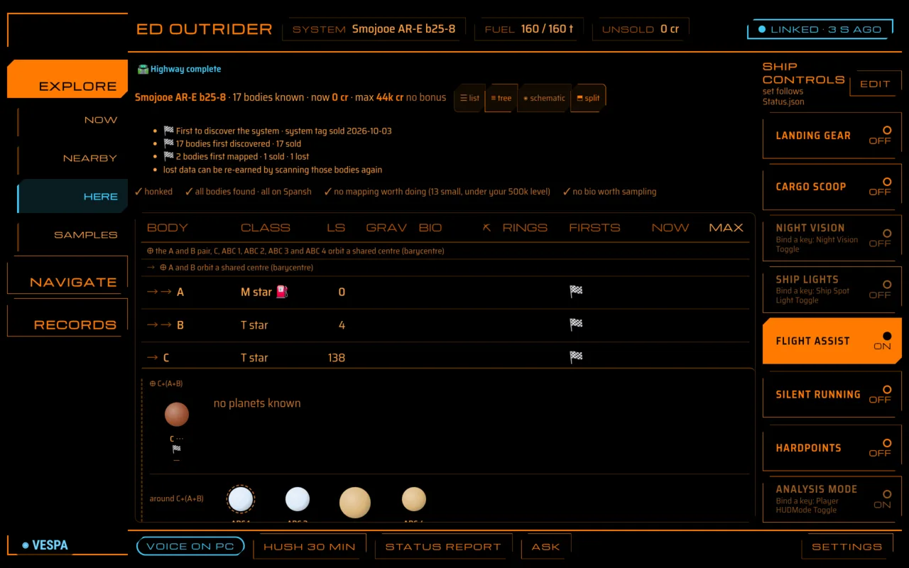
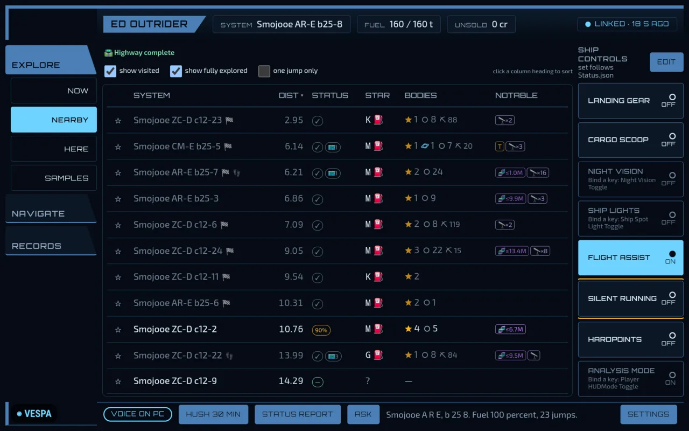
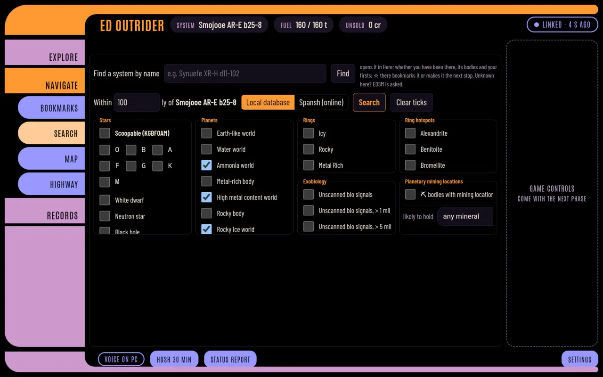
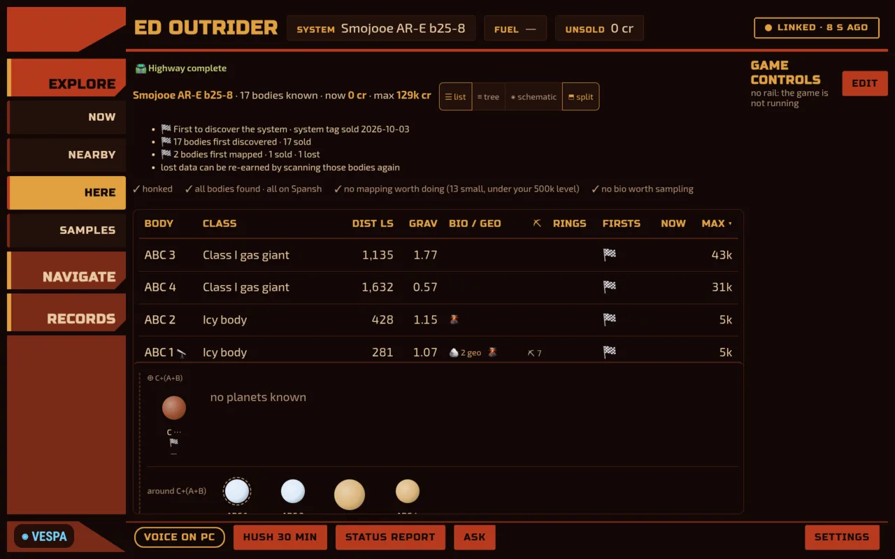
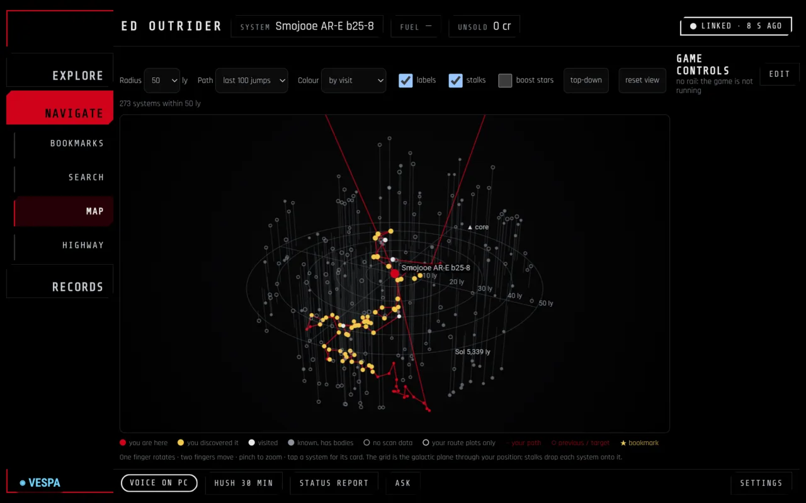
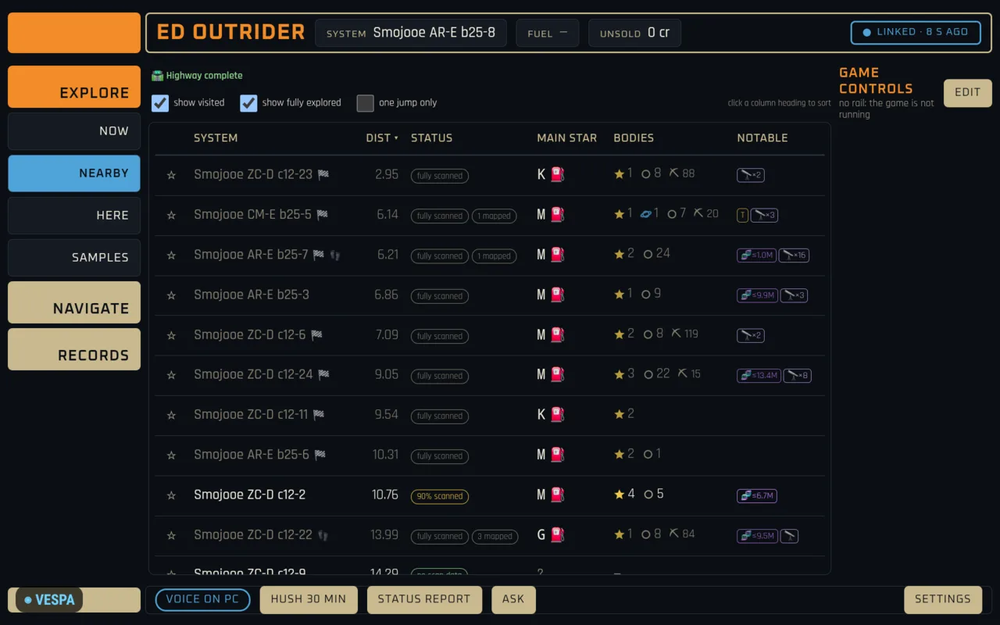
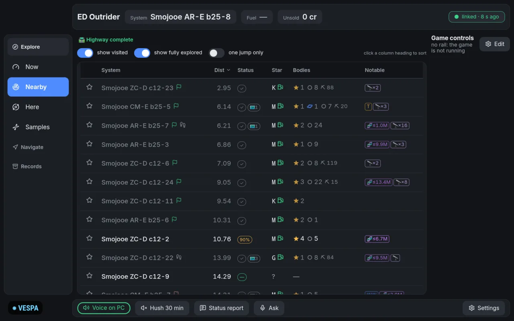
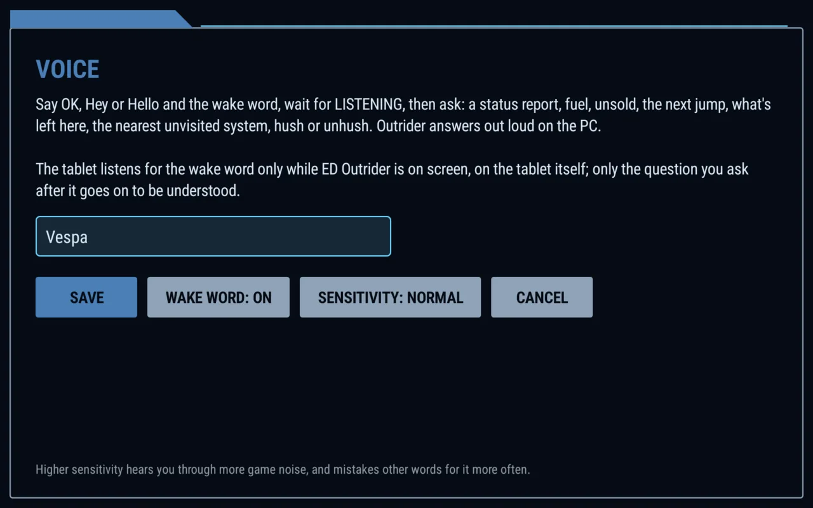

<p align="center">
  
</p>

<h1 align="center">ED Outrider for Android</h1>

<p align="center">
  <b>Your exploration assistant on a second screen: a cockpit tablet for <a href="https://github.com/weslocke/ED-Outrider">ED Outrider</a>.</b>
</p>

<p align="center">
  <a href="https://github.com/weslocke/ED-Outrider"></a>
  
  
  
</p>

---

## What this is

**[ED Outrider](https://github.com/weslocke/ED-Outrider)** is an Elite Dangerous exploration assistant that runs on
your own machines: on the gaming PC, or on another computer on your network. It reads your game journals as you play and keeps a live page up to date with what an explorer keeps
alt-tabbing for: who has been to the systems around you, what's in the one you're in, what your unsold data is worth,
your bio samples and first discoveries, the Neutron Highway route, and spoken alerts.

**This app is a client for it.** It puts Outrider's tablet layout on an Android tablet beside your HOTAS, so the game
keeps the whole monitor. Outrider still does all the work, wherever it runs; the app is the cockpit display, and it adds what
a browser tab can't: a full-screen landscape window that keeps the screen on, signs in by itself, reconnects after
the tablet sleeps, and listens for your voice.

> You need ED Outrider running on a computer on your network: this app does nothing on its own. Get it at
> **[github.com/weslocke/ED-Outrider](https://github.com/weslocke/ED-Outrider)**.

<p align="center">
  
</p>

## Features

| | |
|---|---|
| 🖥️ **Cockpit display** | Outrider's tablet layout full screen, landscape, screen kept on: Now, Nearby, Here, Samples, Bookmarks, Search, Map, Highway, History, Log, Materials and My firsts. |
| 🕹️ **Ship controls** | A column of game buttons (landing gear, cargo scoop, lights, silent running, ...) that press your own key bindings in the game, lit from the game's own status. Changes with the vehicle: ship, SRV, fighter, on foot. *(Needs Outrider on the gaming PC, on Linux; an Outrider in server mode shows no game buttons.)* |
| 🎙️ **"Hey Vespa"** | Say *"Hey / OK / Hello Vespa"*, then ask: *status report*, *fuel*, *unsold*, *next jump*, *what's left here*, *nearest unvisited*, *hush*. Outrider answers out loud in its own voice. The wake word is yours to change. |
| 🎨 **Themes** | LCARS, Elite (cockpit HUD), Babylon 5 (Earthforce and Narn), Star Wars (Sith and Alliance) and a modern Dark mode, picked in the page's settings; the app's own screens follow. |
| 🔒 **Signs in once** | When Outrider asks devices on the network for a password, the app signs in and stays signed in until it changes. |
| 🔁 **Reconnects** | Says plainly when Outrider can't be reached, and picks up again by itself when it's back. |
| ⬇️ **Exports** | Outrider's CSV and JSON exports save to the tablet's Downloads. |

<p align="center">
  
  
</p>

<p align="center">
  
  
  
</p>

<p align="center">
  
</p>

<p align="center"><sub>Seven themes: Elite, Babylon 5 (Earthforce), LCARS, Narn, Sith, Rebel Alliance, and a modern Dark mode.</sub></p>

## Getting started

**You need**

- [ED Outrider](https://github.com/weslocke/ED-Outrider), a version with the tablet layout, running on a computer on
  your network (the gaming PC, or another machine such as a home server) and listening on the network:
  `[server] host = "0.0.0.0"` in `ed_outrider.toml` (not only `127.0.0.1`).
- An Android tablet with Android 8 or newer on the same network. It's built for an 11" landscape screen (tested on a
  Galaxy Tab A11+).

**Install.** The app is sideloaded, not from an app store. Download `ED-Outrider-<version>.apk` from the
[releases](https://github.com/weslocke/ED-Outrider-Android/releases) and open it on the tablet (allow installing from
that source when Android asks), or from a PC with the tablet on USB:

```bash
adb install -r ED-Outrider-1.0.0.apk
```

**First start.** Enter the address of the computer running Outrider, e.g. `192.168.1.20` (add `:port` if Outrider doesn't use 8025). If Outrider
has a `[server] password`, the app asks for it once.

**Using it.** The tablet layout is Outrider's: tap the groups on the left, the pages under them, rows for details.
Press **Back** for the app's own menu: back to Outrider, reload, ask, voice, settings, sign out.

## Voice

Say **"Hey Vespa"**, **"OK Vespa"** or **"Hello Vespa"**, wait for **LISTENING**, then ask your question. Outrider
answers out loud in its own voice, and the answer shows on the tablet too. A small **◉ VESPA** in the
bottom-left corner shows that the tablet is listening for the wake word. You can also tap **Ask** (in the page's
footer or the Back menu) instead of saying it.

In **Back → Voice**:

<p align="center">
  
</p>

- **the wake word**: any word in plain letters, *Vespa* by default (the prefixes OK, Okay, Hey and Hello stay);
- **on or off**;
- **sensitivity**: *High* hears you through more game noise, and mistakes similar words for it more often.

The wake word is spotted on the tablet by a small open model ([sherpa-onnx](https://github.com/k2-fsa/sherpa-onnx)),
so with loud game audio it can miss: raise the sensitivity, or tap Ask.

## Privacy and security

- The app talks **only to the Outrider address you give it**, over plain HTTP on your own network, and loads nothing else
  (other links open in the browser).
- The **wake word** is listened for on the tablet itself, only while the app is on screen. No audio is kept or sent
  for it.
- After the wake word (or Ask), **your question** goes through Android's speech recognizer: on the tablet when Android
  has an offline speech pack for your language, otherwise through the recognizer's own online service (Google's, on
  most tablets). The text then goes to Outrider like any other request.
- Outrider's **password** stops accidents (another device on the network pressing game keys), not a determined
  attacker on your network: it crosses the network unencrypted. The app keeps the session token Outrider gives it,
  never the password.

Release APKs are signed with this certificate; an update signed with any other key won't install over it:

```
CN=weslocke, O=ED Outrider
SHA-256 d7:e6:1a:4d:45:fb:ba:27:7e:7e:b1:ca:e6:b6:26:3d:ed:82:09:74:ce:94:65:a6:d2:09:2f:97:75:7f:59:8c
```

## Building

You need the Android SDK (platform 36), pointed to by `ANDROID_HOME` or a `local.properties` file
(`sdk.dir=/path/to/Android/Sdk`). Nothing else: the Gradle wrapper fetches Gradle, and a JDK 21 into
`~/.gradle/jdks` if the PC has none (a Java runtime alone can't compile). The first build also downloads the wake
word's engine and model into `app/voice/` (about 55 MB, checked against pinned SHA-256s; `./gradlew fetchVoice`).

```bash
./gradlew testDebugUnitTest      # unit tests
./gradlew assembleDebug          # app/build/outputs/apk/debug/ED-Outrider-<version>-debug.apk
./gradlew assembleRelease        # signed if a signing key is configured (below), unsigned otherwise
```

The debug build installs beside the release build (its package ends in `.debug`), uses the SDK's debug key, and lets
`chrome://inspect` on the PC inspect the page.

<details>
<summary><b>Release signing</b></summary>

The key is never in the repository. The build reads a properties file, `~/.android/outrider-release.properties`
(or the path in `OUTRIDER_SIGNING`):

```properties
storeFile=/home/you/.android/outrider-release.jks
storePassword=...
keyAlias=outrider
keyPassword=...
```
</details>

<details>
<summary><b>Trying it without Outrider</b></summary>

`tools/fake_outrider.py` (Python 3, standard library only) stands in for Outrider's side of the app contract, with a
test page for the app's features. Set the app's address to `<this PC>:8026`.

```bash
python3 tools/fake_outrider.py                  # port 8026, password "test"
python3 tools/fake_outrider.py --password ""    # no password
python3 tools/fake_outrider.py --api 2          # Outrider newer than the app: "update the app"
python3 tools/fake_outrider.py --old            # no /api/version: "update Outrider"
```

Debug builds also take a question from adb, as if it had been heard, to test `/api/ask` without speaking:

```bash
adb shell "am start -n io.github.weslocke.outrider.debug/io.github.weslocke.outrider.MainActivity --es debug_ask 'how much fuel'"
```
</details>

<details>
<summary><b>How the app and Outrider fit together</b></summary>

The pages are Outrider's: the app shows them in a WebView and adds what a browser tab can't. What the app's own code
relies on is a small, versioned contract (Outrider's `API_VERSION`, which this app calls the app contract). Both sides
ignore fields they don't know.

| | |
|---|---|
| `GET /api/version` | `{"outrider", "api", "min_app", "password", "signed_in", "game_pc"}`, open without a session (`game_pc`: false for Outrider in server mode) |
| `POST /api/auth/signin` | `{"password"}` → `{"ok", "token"}` and a session cookie |
| `POST /api/auth/signout` | ends the session |
| `POST /api/ask` | `{"text", "source": "vespa"}` → `{"answer", "spoken", "matched", "command"}` (Outrider speaks the answer) |
| Errors | `{"error": "<words>", "code": "<code>"}`: `bad_password`, `rate_limited` (+ `Retry-After`), `signin_required`, `app_too_old` (426), ... |
| Headers | the app sends `X-Outrider-App: <version>` and `Authorization: Bearer <token>` on its own calls |

The page sees `window.OutriderApp` (bridge version 1) and feature-detects each part, so it also works in a plain
browser. The bridge exists only on the configured Outrider's pages.

| | |
|---|---|
| `bridgeVersion` | `1` |
| `appVersion()` | e.g. `"1.0.0"` |
| `haptic(ms)` | a short vibration, up to 100 ms (nothing on tablets without a motor) |
| `signInRequired()` | the session is gone: the app signs in again and reloads the page |
| `setTheme(name)` | `"lcars"`, `"elite"`, `"babylon5"`, `"narn"`, `"sith"`, `"alliance"` or `"dark"`, so the app's own screens match the page |
| `listen()` | listen for one spoken question, send it to `POST /api/ask` and show the answer |
</details>

## Credits

- [ED Outrider](https://github.com/weslocke/ED-Outrider), which this app is a window onto.
- [sherpa-onnx](https://github.com/k2-fsa/sherpa-onnx) and its English keyword-spotting model (Apache-2.0), for the
  wake word.
- Elite Dangerous is © Frontier Developments plc. This is an unofficial fan project, not affiliated with or endorsed
  by Frontier. The themes are inspired by Star Trek's LCARS, Babylon 5 and Star Wars and use no assets from any of them;
  the Dark theme's icons are [Lucide](https://lucide.dev) (ISC), served by Outrider.

## Licence

ED Outrider for Android is free software under the [GNU GPL v2 or later](LICENSE), like ED Outrider.
